# 🏛️ LawChronicle Pipeline Flow Diagram

## 📋 Complete Data Processing Pipeline

```mermaid
graph TD
    %% Raw Data Input
    A[📄 Raw Statute Data<br/>Statute-Batch-1.statute.json] --> B[01_data_ingestion]
    
    %% Data Ingestion
    B --> B1[connect_existing_db.py<br/>Connect to existing database]
    
    %% Database Normalization
    B1 --> C[02_db_normalization]
    C --> C1[create_clean_db.py<br/>Create clean database structure]
    C1 --> C2[normalize_structure.py<br/>Normalize data structure]
    
    %% Field Cleaning & Splitting
    C2 --> D[03_field_cleaning_splitting]
    D --> D1[bring_common_fields_up.py<br/>Move common fields to top level]
    D1 --> D2[drop_unnecessary_fields.py<br/>Remove unnecessary fields]
    D2 --> D3[cleaning_single_section.py<br/>Clean individual sections]
    D3 --> D4[sort_sections.py<br/>Sort sections by number]
    D4 --> D5[remove_preamble_duplicates_advanced.py<br/>Remove duplicate preambles]
    D5 --> D6[split_cleaned_statute.py<br/>Split cleaned statutes]
    
    %% Date Processing
    D6 --> E[04_date_processing]
    E --> E1[get_null_dates.py<br/>Identify missing dates]
    E1 --> E2[search_dates.py<br/>Search for dates in text]
    E2 --> E3[search_dates_regex.py<br/>Extract dates with regex]
    E3 --> E4[parse_dates.py<br/>Parse and standardize dates]
    E4 --> E5[enrich_missing_dates.py<br/>Fill missing dates]
    
    %% Statute Versioning
    E5 --> F[05_statute_versioning]
    F --> F1[group_statutes_by_base.py<br/>Group statutes by base name]
    F1 --> F2[assign_statute_versions.py<br/>Assign version labels]
    F2 --> F3[remove_duplicates.py<br/>Remove duplicate statutes]
    
    %% Section Versioning
    F3 --> G[06_section_versioning]
    G --> G1[split_sections.py<br/>Extract sections from statutes]
    G1 --> G2[assign_section_versions.py<br/>Assign section versions]
    G2 --> G3[export_section_versions.py<br/>Export to JSON]
    G2 --> G4[create_consolidated_statutes.py<br/>Create consolidated statutes]
    G2 --> G5[create_grouped_statute_db.py<br/>Create grouped statute DB]
    G3 --> G6[generate_metadata_summary.py<br/>Generate metadata summary]
    G4 --> G6
    G5 --> G6
    
    %% Export Pipeline
    G6 --> H[07_export_pipeline]
    H --> H1[export_to_json.py<br/>Export to JSON format]
    H --> H2[export_to_mongo.py<br/>Export to MongoDB]
    
    %% Output Files
    G3 --> I[📄 JSON Exports<br/>all_section_versions.json]
    G4 --> J[🗄️ Consolidated Database<br/>Consolidated-Statutes.statute]
    G5 --> K[🗄️ Grouped Database<br/>Grouped-Statute-Versions.statute]
    G6 --> L[📊 Metadata Files<br/>metadata/ folder]
    H1 --> M[📄 Final JSON Exports]
    H2 --> N[🗄️ Final MongoDB Exports]
    
    %% Styling
    classDef ingestion fill:#e1f5fe
    classDef normalization fill:#f3e5f5
    classDef cleaning fill:#fff3e0
    classDef dates fill:#e8f5e8
    classDef versioning fill:#fce4ec
    classDef sectioning fill:#f1f8e9
    classDef export fill:#e0f2f1
    classDef output fill:#fff8e1
    
    class B,B1 ingestion
    class C,C1,C2 normalization
    class D,D1,D2,D3,D4,D5,D6 cleaning
    class E,E1,E2,E3,E4,E5 dates
    class F,F1,F2,F3 versioning
    class G,G1,G2,G3,G4,G5,G6 sectioning
    class H,H1,H2 export
    class I,J,K,L,M,N output
```



## 🚀 Quick Start Commands

### **Phase 1: Data Ingestion & Normalization**
```bash
# Connect to existing database
python 01_data_ingestion/connect_existing_db.py

# Normalize database structure
python 02_db_normalization/create_clean_db.py
python 02_db_normalization/normalize_structure.py
```

### **Phase 2: Field Cleaning & Splitting**
```bash
# Clean and organize fields
python 03_field_cleaning_splitting/bring_common_fields_up.py
python 03_field_cleaning_splitting/drop_unnecessary_fields.py
python 03_field_cleaning_splitting/cleaning_single_section.py
python 03_field_cleaning_splitting/sort_sections.py
python 03_field_cleaning_splitting/remove_preamble_duplicates_advanced.py
python 03_field_cleaning_splitting/split_cleaned_statute.py
```

### **Phase 3: Date Processing**
```bash
# Process and enrich dates
python 04_date_processing/get_null_dates.py
python 04_date_processing/search_dates.py
python 04_date_processing/search_dates_regex.py
python 04_date_processing/parse_dates.py
python 04_date_processing/enrich_missing_dates.py
```

### **Phase 4: Statute Versioning**
```bash
# Group and version statutes
python 05_statute_versioning/group_statutes_by_base.py
python 05_statute_versioning/assign_statute_versions.py
python 05_statute_versioning/remove_duplicates.py
```

### **Phase 5: Section Versioning**
```bash
# Process sections
python 06_section_versioning/split_sections.py
python 06_section_versioning/assign_section_versions.py

# Export and consolidate (can run in parallel)
python 06_section_versioning/export_section_versions.py
python 06_section_versioning/create_consolidated_statutes.py
python 06_section_versioning/create_grouped_statute_db.py

# Generate metadata summary
python 06_section_versioning/generate_metadata_summary.py
```

### **Phase 6: Final Export**
```bash
# Export to final formats
python 07_export_pipeline/export_to_json.py
python 07_export_pipeline/export_to_mongo.py
```

## 📊 Database Flow

| Phase | Input Database | Output Database | Purpose |
|-------|----------------|-----------------|---------|
| **01** | Raw data | Connected DB | Connect to existing data |
| **02** | Connected DB | Clean DB | Normalize structure |
| **03** | Clean DB | Cleaned DB | Clean and organize fields |
| **04** | Cleaned DB | Date-enriched DB | Process dates |
| **05** | Date-enriched DB | Statute-Versioned | Group and version statutes |
| **06** | Statute-Versioned | Section-Versioned | Process sections |
| **07** | Section-Versioned | Final exports | Export to various formats |

## 🎯 Key Outputs

- **📄 JSON Exports**: `all_section_versions.json`
- **🗄️ Consolidated Database**: `Consolidated-Statutes.statute`
- **🗄️ Grouped Database**: `Grouped-Statute-Versions.statute`
- **📊 Metadata**: `metadata/` folder with comprehensive tracking
- **📄 Final Exports**: Various formats for external use

## ⚡ Parallel Processing

**Steps that can run in parallel:**
- `export_section_versions.py` and `create_consolidated_statutes.py` (same input)
- `export_to_json.py` and `export_to_mongo.py` (same input)

## 🔧 Prerequisites

```bash
# Install dependencies
pip install -r requirements.txt

# Ensure MongoDB is running
mongod --dbpath /path/to/data/db
```

## 📈 Metadata Tracking

Every script includes comprehensive metadata tracking saved to:
```
metadata/
├── base_name_grouping_metadata_YYYYMMDD_HHMMSS.json
├── versioning_metadata_YYYYMMDD_HHMMSS.json
├── section_splitting_metadata_YYYYMMDD_HHMMSS.json
├── section_versioning_metadata_YYYYMMDD_HHMMSS.json
├── section_export_metadata_YYYYMMDD_HHMMSS.json
├── consolidation_metadata_YYYYMMDD_HHMMSS.json
├── grouped_statute_metadata_YYYYMMDD_HHMMSS.json
└── analysis_metadata_YYYYMMDD_HHMMSS.json
``` 