# Pakistan Legal Data Processing Pipeline Architecture

```mermaid
graph LR
    %% Phase 1: Raw HTML Files (Extraction)
    subgraph PHASE1["Phase 1: Raw HTML Files"]
        WEB1["Source Web1<br/>Pakistan Legal Sites"]
        WEB2["Source Web2<br/>EAGLAW, PLJ, PLS"]
        FETCH["Fetch HTML"]
        CHECK["Check if already in<br/>❌ Skip if exists"]
        CLEAN1["Clean HTML"]
        SAVE_DISK["Save to Disk<br/>Raw HTML Files"]
        TOTAL_INFO["Total Date, Source, Names"]
    end

    %% Phase 2: Custom Phase (Text Only)
    subgraph PHASE2["Phase 2: Custom Phase"]
        CUSTOM_PHASE["Custom Phase<br/>Text Only"]
        GPT_4O1["GPT-4o<br/>AI Processing"]
        CUSTOM_JSON["Custom JSON<br/>Text Output"]
        DIR1["Directory<br/>Custom JSON Files"]
    end

    %% Phase 3: Base Phase (Text + Base Schema)
    subgraph PHASE3["Phase 3: Base Phase"]
        BASE_PHASE["Base Phase<br/>Text + Base Schema"]
        GPT_4O2["GPT-4o<br/>AI Processing"]
        BASE_JSON["Base JSON<br/>Text + Schema Output"]
        DIR2["Directory<br/>Base JSON Files"]
    end

    %% Phase 4: Merge Phase
    subgraph PHASE4["Phase 4: Merge Phase"]
        MERGE_PHASE["Merge Phase<br/>Combine Custom + Base"]
        GPT_4O3["GPT-4o<br/>AI Processing"]
        FINAL_JSON["Final JSON<br/>Merged Schema"]
        FINAL_DIR["Final JSON Directory<br/>Silver Layer"]
    end

    %% Phase 5: Load Phase
    subgraph PHASE5["Phase 5: Load Phase"]
        LOAD_PHASE["Load Phase"]
        MONGO1["MongoDB 1<br/>Silver Data"]
        MONGO2["MongoDB 2<br/>Silver Data"]
    end

    %% Phase 6: Deduplication Phase
    subgraph PHASE6["Phase 6: Deduplication Phase"]
        DEDUPER["De-duper<br/>Deduplication Engine"]
        DEDUP_CRITERIA["Key Set, Judge, App, Neo, Count, Result, Key Issues"]
        REFINED_DB1["Refined DB1<br/>Cleaned Data"]
        REFINED_DB2["Refined DB2<br/>Cleaned Data"]
        MAX_KEY_DOC["Max Key Document<br/>Best Match Selection"]
        SAVE_NAME["Save Name"]
        CLEAN2["Clean<br/>Final Cleaning"]
    end

    %% Phase 7: Unified Schema Phase
    subgraph PHASE7["Phase 7: Unified Schema Phase"]
        UNIFIED_SCHEMA["Unified Schema JSON<br/>Gold Layer Schema"]
        GPT_4O4["GPT-4o<br/>AI Processing"]
        UNIFIED_JSON["Unified JSON<br/>Gold Layer Output"]
        FINAL_DB["Final Database<br/>Gold Layer"]
    end

    %% Unification Criteria
    subgraph CRITERIA["Unification Criteria"]
        LOOP_BASED["Loop based on<br/>DB/Source"]
        DATE_CRIT["Date"]
        SECOND_SOURCE["Second Source<br/>Name"]
        NO_DUPLICATES["Duplicates - No"]
        NAME_TITLE["Name - Title Key"]
    end

    %% Data Flow Connections
    WEB1 --> FETCH
    WEB2 --> FETCH
    FETCH --> CHECK
    CHECK --> CLEAN1
    CLEAN1 --> SAVE_DISK
    SAVE_DISK --> CUSTOM_PHASE
    SAVE_DISK --> BASE_PHASE
    
    CUSTOM_PHASE --> GPT_4O1
    GPT_4O1 --> CUSTOM_JSON
    CUSTOM_JSON --> DIR1
    
    BASE_PHASE --> GPT_4O2
    GPT_4O2 --> BASE_JSON
    BASE_JSON --> DIR2
    
    DIR1 --> MERGE_PHASE
    DIR2 --> MERGE_PHASE
    MERGE_PHASE --> GPT_4O3
    GPT_4O3 --> FINAL_JSON
    FINAL_JSON --> FINAL_DIR
    FINAL_DIR --> LOAD_PHASE
    LOAD_PHASE --> MONGO1
    LOAD_PHASE --> MONGO2
    
    MONGO1 --> DEDUPER
    DEDUPER --> REFINED_DB1
    DEDUPER --> REFINED_DB2
    REFINED_DB1 --> MAX_KEY_DOC
    REFINED_DB2 --> MAX_KEY_DOC
    MAX_KEY_DOC --> SAVE_NAME
    SAVE_NAME --> CLEAN2
    CLEAN2 --> UNIFIED_SCHEMA
    UNIFIED_SCHEMA --> GPT_4O4
    GPT_4O4 --> UNIFIED_JSON
    UNIFIED_JSON --> FINAL_DB

    %% Criteria connections
    CRITERIA -.->|"Apply Rules"| DEDUPER
    CRITERIA -.->|"Apply Rules"| UNIFIED_SCHEMA

    %% Styling
    classDef phase1Style fill:#e3f2fd,stroke:#1976d2,stroke-width:2px
    classDef phase2Style fill:#f3e5f5,stroke:#7b1fa2,stroke-width:2px
    classDef phase3Style fill:#e8f5e8,stroke:#388e3c,stroke-width:2px
    classDef phase4Style fill:#fff3e0,stroke:#f57c00,stroke-width:2px
    classDef phase5Style fill:#fce4ec,stroke:#c2185b,stroke-width:2px
    classDef phase6Style fill:#e0f2f1,stroke:#00695c,stroke-width:2px
    classDef phase7Style fill:#fff8e1,stroke:#f57f17,stroke-width:2px
    classDef criteriaStyle fill:#f3e5f5,stroke:#4a148c,stroke-width:2px

    class PHASE1 phase1Style
    class PHASE2 phase2Style
    class PHASE3 phase3Style
    class PHASE4 phase4Style
    class PHASE5 phase5Style
    class PHASE6 phase6Style
    class PHASE7 phase7Style
    class CRITERIA criteriaStyle
```

## Pipeline Phases Overview

### Phase 1: Raw HTML Files (Extraction)
- **Input**: Pakistan legal websites (EAGLAW, PLJ, PLS)
- **Process**: Fetch HTML → Check if exists → Clean → Save to disk
- **Output**: Raw HTML files with metadata (date, source, names)

### Phase 2: Custom Phase (Text Only)
- **Input**: Raw HTML files
- **Process**: Custom Phase → GPT-4o → Custom JSON
- **Output**: Custom JSON files (text only)

### Phase 3: Base Phase (Text + Base Schema)
- **Input**: Raw HTML files
- **Process**: Base Phase → GPT-4o → Base JSON
- **Output**: Base JSON files (text + base schema)

### Phase 4: Merge Phase
- **Input**: Custom and Base JSON files
- **Process**: Merge Phase → GPT-4o → Final JSON
- **Output**: Merged schema data (Silver layer)

### Phase 5: Load Phase
- **Input**: Merged JSON files
- **Process**: Load Phase → MongoDB storage
- **Output**: Silver layer data in MongoDB

### Phase 6: Deduplication Phase
- **Input**: Silver layer data from MongoDB
- **Process**: Deduplication → Refined DBs → Max Key Document → Clean
- **Output**: Deduplicated and cleaned data

### Phase 7: Unified Schema Phase
- **Input**: Deduplicated data
- **Process**: Unified Schema JSON → GPT-4o → Unified JSON
- **Output**: Unified schema data ready for consumption

### Unification Criteria
- Loop based on DB/Source
- Date matching
- Second source name validation
- No duplicates policy
- Name-title key matching

## Key Features:
- **7 Distinct Phases**: Clear separation of concerns
- **AI Processing**: GPT-4o used at multiple stages
- **Dual Schema Approach**: Custom (text only) and Base (text + schema) processed separately
- **Deduplication**: Sophisticated deduplication with multiple criteria
- **Quality Assurance**: Multiple cleaning and validation steps
- **Scalable Architecture**: Modular design with clear phase boundaries
